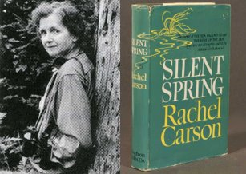
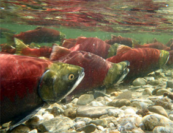
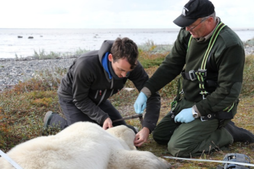

---
title:
author:
date:
output:
  revealjs::revealjs_presentation:
    css: style.css
    incremental: false
    theme: night
    highlight: tango
    transition: none
    center: true
---

# {data-background-color="#0a4f58"}

<h2 style="color: #de3c26;">
Initiative Background and Overview
</h2>

<h3>
Workshop: Developing Standard Protocols for Assessing Aquatic Barriers in Canada
</h3>

<h5>
Nick Mazany-Wright
</h5>

<h5>
February 28, 2023
</h5>

&nbsp;
&nbsp;
&nbsp;
&nbsp;

<div class="container">
<div class="col">
``` {r, echo=FALSE, out.width="50%", fig.align="left"}

knitr::include_graphics("./img/white-cwf-logo-en.svg")

#AWC3

```
</div>

<div class="col" style="justify-self: end; align-content: end;">
<span style="font-family: Bebas Neue;"></span>
</div>

</div>

# Canadian Wildlife Federation

## Who We Are

- One of Canada's largest environmental NGOs
- Originated in 1962 from fish and wildlife conservation movement
- "To conserve and inspire the conservation of Canada's wildlife and habitats for the use and enjoyment for all"
- Freshwater, marine, and terrestrial programs

&nbsp;

<center>
{height=200px} {height=200px} {height=200px}
</center>

## CWF's Approach to Conservation

1. Instill conservation ethic in Canadians
2. Engage Canadians in conservation actions
3. Fill gaps in our scientific understanding of species and threats
4. Carry out species and habitat conservation projects
5. Advocate for strong laws, policies, and programs to conserve wildlife and habitat

&nbsp;

<center>
{height=175px} {height=175px} {height=175px} {height=175px}
</center>

## National Fish Passage Program

Increased freshwater focus on connectivity and fish passage:

- Chinook salmon research in Upper Yukon River
- American eel research and advocacy
- Fish passage advocacy and barrier campaigns
- Watershed Connectivity Remediation Planning framework and barrier remediation in BC, AB, PEI, and NS
- Spatial tools to assess watershed connectivity and prioritize barriers for remediation
- **<span style="color: #de3c26;">Development of the Canadian Aquatic Barriers Database (CABD)</span>**

<center>
{height=160px} {height=160px}  {height=160px}
</center>

# Why develop standard protocols for assessing aquatic barriers in Canada?

## What is the conservation issue?

What we know:

- Structures like dams, culverts, and dykes block the movement of fish (and other species) and energy/matter
- Barriers to connectivity are extensive across Canada
- Barriers removal needed to restore access to important habitat and ecosystem functions
- Restoration projects are expensive

<center>
{height=200px} {height=200px} {height=200px}
</center>

## What is the conservation issue?

What we don't know:

- How many barriers exist in Canada?
- How much habitat is not accessible?
- How do we identify the most important barriers to maximize benefits?

## Towards Answers

**<span style="color: #de3c26;">What is needed to support fish passage and freshwater connectivity restoration?</span>**

1. Comprehensive information sources
2. Field assessment protocols and methods

## CWF's Work

CWF aiming to address these needs with the CABD project

1. National database
2. National standardized barrier assessment protocols

## National standardized assessment protocols

- Several barrier assessment protocols have been developed for different regions in Canada (replace with assorted pictures of protocols?)
- No national standard = independent development of protocols region by region
- Gaps/limited application of protocols for:
  + Low-head dams
  + Waterfalls
  + Lateral barriers
  + Specialized structures (e.g., tide gates/aboiteaux)
- CABD requires standardized data structures

## CWF's Desired Outcomes

- It is **<span style="color: #de3c26;">not</span>** our expectation to replace existing regional protocols
- Our goals:
  + Learn from the application of existing protocols and programs
  + Support compatibility and data sharing, where desired and feasible
  + Provide a protocol that can be applied across Canada, where regional protocols do not exist

## Workshop Objectives

1. Share and learn from existing stream crossing protocols and programs, including successes, lessons learned, and opportunities/limitations of standardization

## Workshop Objectives

2. Identify implications of overlapping protocols, how to manage compatibility or lack thereof, and avoid duplication of effort

## Workshop Objectives

3. Elicit feedback on proposed national assessment protocols for stream crossings and inform the CABD data structure

## Workshop Scope

An important question we were asked: **<span style="color: #de3c26;">Why are we assessing crossings?</span>**

Different groups may not be assessing crossings for the same reasons:

- Aquatic species passability
- Infrastructure management
- Conformance and compliance

## Workshop Scope

Development of field protocols and assessment methods to assess stream crossings for **<span style="color: #de3c26;">passability</span>**

## Additional considerations

1. Scoring systems - what is a barrier to fish?
2. Conformance to BMPs and compliance with regulation

Out of scope to date, but will discuss path forward during Day 2

# Canadian Aquatic Barriers Database (CABD)

## What is needed to support fish passage and freshwater connectivity restoration?

1. Comprehensive information sources
2. Field assessment protocols and methods

## Canadian Aquatic Barriers Database (CABD)

<center>
**<span style="color: #de3c26;">Vision:</span>**
</center>

<center>
All Canada's barrier and connectivity information in one place -- easily and openly accessible!
</center>

## Project Background

- CABD = central pillar of tools to support CWF's fish passage program
- Identify and prioritize barriers for restoration
- Inspired The Nature Conservancy's (TNC) work in the northeastern U.S.

<center>

</center>

## A Roadmap for Improving Connectivity

- TNC's Northeast Aquatic Connectivity Assessment Project:
  + A database as a partnership building tool
  + Brings groups together and centralizes efforts
  + Led to significant improvements to fish passage and connectivity

## Penobscot River Restoration (Maine)

- Partnership between government, Indigenous groups, NGOs, and industry
- Two dam removals and one fishway
- 2018: **<span style="color: #de3c26;">2.8 million+</span>** river herring returned

<center>
{height=450px}
</center>

## Importance of Collaboration and Engagement

- Potential uses of CABD extend beyond CWF's needs
  + Freshwater connectivity research
  + Hydrological modelling
  + Infrastructure inventories
- CABD can improve collaboration and partnership
- Launched external engagement to get input on development

<center>
{height=250px}
</center>

## Stakeholder Engagement

- User interviews
  + What type of work could the CABD support?
  + What information would be useful?
  + How would users like to access the data?
- Working Group and Technical Advisory Committee

&nbsp;

<center>
{height=50px} {height=50px} {height=50px} {height=50px} {height=50px}
</center>

<center>
{height=25px} {height=50px} {height=25px}
{height=50px} {height=50px}
</center>

<center>
{height=50px} {height=50px} {height=50px}
{height=50px}
{height=50px}
</center>

## Data Gathering and Sharing

- CABD relies on existing repositories
  + Local in scale
  + Single barrier types
  + No standardization
- CWF provides national coordination **<span style="color: #de3c26;">without</span>** duplicating effort
- Establish **<span style="color: #de3c26;">reciprocal</span>** relationships
  + Share data back to providers

&nbsp;

<center>
{height=200px} {height=200px}
</center>

## What will the CABD be used for?

1. Habitat status assessments and reporting (watershed &rarr; national scales)
2. Informing management and regulatory decisions
3. Restoration planning and prioritization
4. Research and monitoring
5. Education and public outreach

## CABD (version 1)

&nbsp;

<span style = "font-size: 175%; font-family: Bebas Neue; padding-left: 105px;">Dams</span> <span style = "font-size: 175%; font-family: Bebas Neue; padding-left: 155px;">Waterfalls</span> <span style = "font-size: 175%; font-family: Bebas Neue; padding-left:125px;">Fishways</span>

{height=300px} {height=300px} {height=300} 

<span style = "font-size: 150%; color: #de3c26; padding-left: 65px;">36,000+</span> <span style = "font-size: 150%; color: #de3c26; padding-left: 140px;">22,000+</span> <span style = "font-size: 150%; color: #de3c26; padding-left:170px;">400+</span>

## Demo!

<center>
<a href="https://cabd-git-develop-foundryspatial.vercel.app/en" data-preview-link>aquaticbarriers.ca</a>
</center>

<center>
<a href="https://cabd-docs.netlify.app/index.html" data-preview-link>Documentation Site</a>
</center>

## Standardized Data Structures

- Central repository requires standardized set of fields
- Facilitate data management and sharing
- Standardized field assessment methods &rarr; standardized data structures

&nbsp;

<center>
{height=300px} {height=300px}
</center>

## National Standardized barrier assessment protocols

- Extensive review and synthesis - existing protocols
- Proposed protocols for stream crossings and elicit expert feedback
  
<center>

</center>

## Desired Outcomes

1. Develop standardized, life-stage and species agnostic stream crossing assessment protocol to:

  + Provide a standardized set of stream crossing assessment protocols for parts of Canada that do no have them
  + Inform standardized data structure for stream crossings in CABD
  
2. In future years, develop assessment protocols for additional barrier types (e.g., tide gates/aboiteaux, waterfalls, lateral structures)


# Thank you!

<center>
<h2>Questions?</h2>
</center>
<center>
nickw@cwf-fcf.org
</center>
<center>
*The Canadian Aquatic Barriers Database is a multi-year project that is supported partially by financial contributions from Fisheries and Oceans Canada and the RBC Foundation.*
</center>

